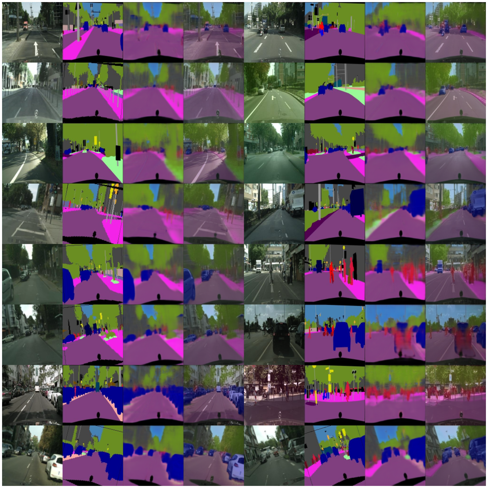

# U-Net-Cityscapes

### Vanilla U-Net implementation for multiclass semantic segmentation on Cityscapes dataset 

Here I have built a Convolutional Neural Network (CNN) based U-Net architecture model to perform semantic segmentation task to segment out various obejcts present in the real world street scene images of [Cityscapes](https://www.kaggle.com/dansbecker/cityscapes-image-pairs) dataset. The results are shown in the image below:

In the above image, first column shows the actual image of testing dataset, second column shows the ideal segmentation which should be performned on the image and third column shows the segmentation result which we got from our model. Our model decently segmented out roads, footpaths, trees, cars and sky but face difficulty with smaller objects like traffic signals, cycles, pedestrians etc. 
